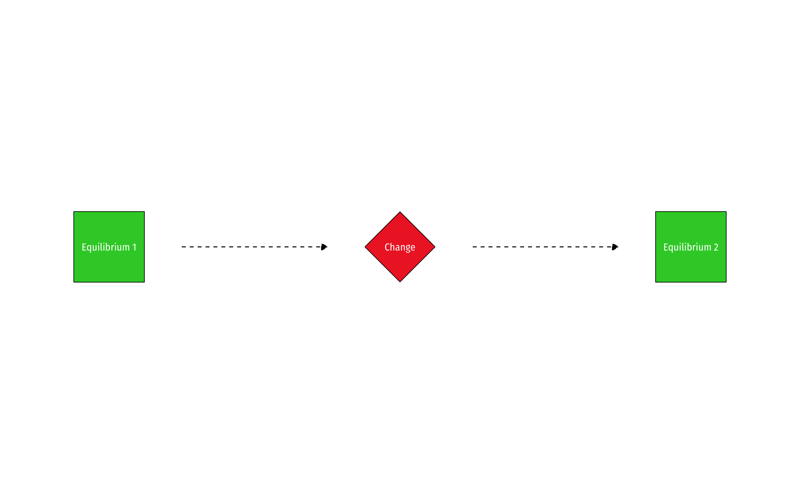
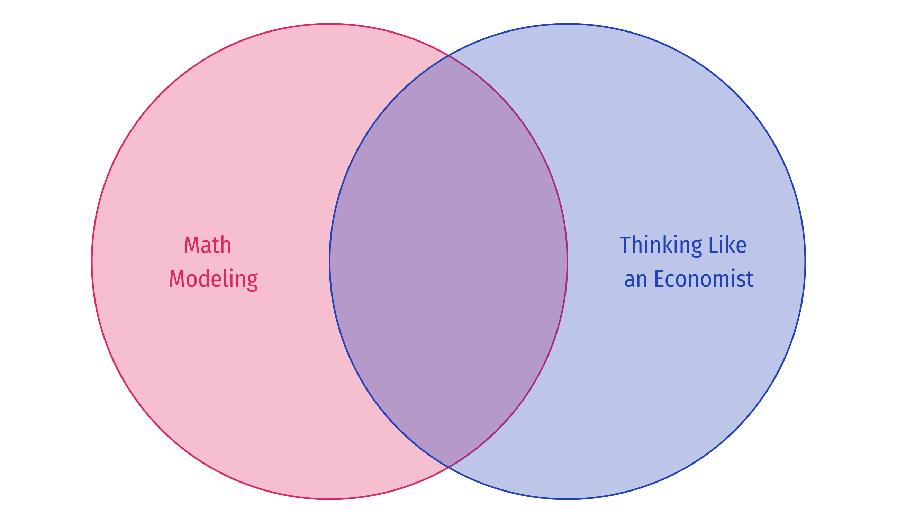

class: inverse

# Outline

### [The Tools of Microeconomics](#19)

### [Incentives](#23)

### [Equilibrium](#34)

### [Real Talk: The Math](#47)

### [About This Course](#59)

------------------------------------------------------------------------

# About Me

.left-column\[ .center\[ \]\]

.right-column\[ .smallest\[\]\]

------------------------------------------------------------------------

# About Me

.left-column\[ .center\[ \]\]

.right-column\[ .smallest\[\]\]

------------------------------------------------------------------------

# The Reason I am Busy AF Behind the Scenes

.center\[ \]

And why I wear a mask.

---
# *Micro*-economics

.center[

]
---

# Micro- vs. Macro-economics

.pull-left\[\]

.pull-right\[ \]

------------------------------------------------------------------------

# Where You Are Now

.pull-left\[ - .hi-purple\[Basic concepts\] of markets, individuals (consumers & firms), economies: - ECON 205: Principles of Macroeconomics - ECON 206: Principles of Microeconomics\]

.pull-right\[ .center\[ \] .footnote\[.magenta\[†\] Required for ECON majors only. Calculus I required.\]\]

------------------------------------------------------------------------

# Economists Speak a Foreign Language...

.pull-left\[\]

.pull-right\[\]

------------------------------------------------------------------------

# ...But You Can Learn It

.pull-left\[\]

.pull-right\[\]

------------------------------------------------------------------------

# Don't Think You Know It Already!

.pull-left\[\]

.pull-right\[\]

------------------------------------------------------------------------

# And Tread Cautiously

.pull-left\[ - But be careful, *a little bit of knowledge* is a dangerous thing!\]

.pull-right\[ .center\[ \]\]

------------------------------------------------------------------------

# Economics $\neq$ Business or \$\$\$

.center\[ \]

------------------------------------------------------------------------

# Economics $\neq$ Business or \$\$\$

.center\[ \]

------------------------------------------------------------------------

# Economics Can Be Difficult

.pull-left\[\]

.pull-right\[\]

------------------------------------------------------------------------

# Economics Can Be Difficult

.pull-left\[\]

.pull-right\[\]

------------------------------------------------------------------------

# The Uses of Economics

.pull-left\[\]

.pull-right\[\]

------------------------------------------------------------------------

# The Uses of Economics

.pull-left\[\]

.pull-right\[\]

------------------------------------------------------------------------

class: inverse, center, middle

# The Tools of Microeconomics

------------------------------------------------------------------------

# Economics as a *Way of Thinking*

.pull-left\[\]

------------------------------------------------------------------------

# Economics as a *Way of Thinking*

.pull-left\[\]

.pull-right\[\]

------------------------------------------------------------------------

# Economics as a *Way of Thinking*

.pull-left\[\]

.pull-right\[\]

------------------------------------------------------------------------

class: inverse, center, middle

# Incentives

------------------------------------------------------------------------

# Incentives Example: Subway I

.center\[ \]

------------------------------------------------------------------------

# Incentives Example: Subway II

.center\[  \]

------------------------------------------------------------------------

# Incentives Example: Rat Bounty

.bg-washed-green.b--dark-green.ba.bw2.br3.shadow-5.ph4.mt5\[ Some governments pay bounties to reduce pest populations such as rats.\]

--

.center\[ \]

------------------------------------------------------------------------

# Incentives: Even Dolphins Understand I

.center\[ \]

.source\[July 2 2003, ["Why Dolphins are Deep Thinkers"](https://www.theguardian.com/science/2003/jul/03/research.science), *The Guardian*\]

------------------------------------------------------------------------

# Incentives: Even Dolphins Understand II

.center\[ \]

.source\[July 2 2003, ["Why Dolphins are Deep Thinkers"](https://www.theguardian.com/science/2003/jul/03/research.science), *The Guardian*\]

------------------------------------------------------------------------

# Incentives: Monkeys Too

.center\[ \]

.source\[January 17, 2021, [These Monkeys Understand Economics and Intentionally Steal High-Ticket Items to Barter for Better Food, Study Finds](https://gizmodo.com/these-monkeys-understand-economics-and-intentionally-st-1846078932?utm_medium=sharefromsite&utm_source=_facebook), *Gizmodo*\]

------------------------------------------------------------------------

# In Fact a Lot of the Natural World Behaves Economically

.pull-left\[ .center\[ \] .source\[Loch-Temzelides, Ted, 2021, ["Walrasian equilibrium behavior in nature"](https://www.pnas.org/content/118/27/e2020961118), *PNAS* 118(27)\]\]

.pull-right\[ .center\[ \] .source\[Katzen et al., 2021, ["The nematode worm *C. elegans* chooses between bacterial foods exactly as if maximizing economic utility"](https://www.biorxiv.org/content/10.1101/2021.04.25.441352v2) *bioRxiv*\]\]

------------------------------------------------------------------------

# Takeaways About Incentives I

.pull-left\[\]

.pull-right\[\]

------------------------------------------------------------------------

# Takeaways About Incentives II

.center\[ \]

------------------------------------------------------------------------

class: inverse, center, middle

# Equilibrium

------------------------------------------------------------------------

# Equilibrium Example I

.pull-left\[ .center\[ \]\]

.pull-right\[\]

------------------------------------------------------------------------

# Equilibrium Example I

.pull-left\[ .center\[ \]\]

.pull-right\[\]

------------------------------------------------------------------------

# Equilibrium Example II

.pull-left\[ .center\[ \]\]

.pull-right\[\]

------------------------------------------------------------------------

# Equilibrium Example III

.pull-left\[ .center\[ \]\]

.pull-right\[\]

------------------------------------------------------------------------

# Equilibrium Example IV

.pull-left\[ .center\[ \]\]

.pull-right\[\]

------------------------------------------------------------------------

# Equilibrium Example V

.pull-left\[ .center\[ \]\]

.pull-right\[ .smaller\[ - .hi-turquoise\[Suppose the State *doubles the capacity* of the local road\]\]\]

------------------------------------------------------------------------

# Equilibrium Example V

.pull-left\[ .center\[ \]\]

.pull-right\[ .smaller\[ - .hi-turquoise\[Suppose the State *doubles the capacity* of the local road\]\]\]

------------------------------------------------------------------------

# Equilibrium Example V

.pull-left\[ .center\[ \]\]

.pull-right\[\]

------------------------------------------------------------------------

# In the Long Run...(& Repeating the Same Mistake)

.center\[ \]

------------------------------------------------------------------------

# Comparative Statics

-   .hi[Comparative statics]: examining changes in equilibria cased by an external change (in incentives, constraints, etc.)

------------------------------------------------------------------------

# Optimization and Equilibrium

.pull-left\[ - If people can .hi-purple\[learn\] and .hi-purple\[change\] their behavior, they will tend to **switch** to a higher-valued option\]

.pull-right\[ .center\[ \]\]

------------------------------------------------------------------------

# Economics Is Broader Than You Think

.center\[ \]

------------------------------------------------------------------------

class: inverse, center, middle

# Real Talk: The Math

------------------------------------------------------------------------

# Real Talk

.center\[ \]

------------------------------------------------------------------------

# Real Talk

.center\[ \]

------------------------------------------------------------------------

# Real Talk

.center\[ \]

------------------------------------------------------------------------

# Real Talk

.pull-left\[ .center\[ \]\]

.pull-right\[\]

------------------------------------------------------------------------

# Why We Model I

.pull-left\[\]

.pull-right\[ .center\[ \]\]

------------------------------------------------------------------------

# Why We Model II

.pull-left\[\]

.pull-right\[ .center\[ \]\]

------------------------------------------------------------------------

# The Two Major Models of Economics as a "Science"

.pull-left\[\]

--

.pull-right\[\]

------------------------------------------------------------------------

# A Hint That Will *Almost* Never Fail You

.pull-left\[\]

.pull-right\[ .center\[ \]\]

------------------------------------------------------------------------

# Remember: All Models are Wrong!

.pull-left\[ .bg-washed-red.b--dark-red.ba.bw2.br3.shadow-5.ph4.mt5\[ .red\[**Caution**:\] Don't conflate models with reality!\] - Models **are not** reality. They help us **understand** reality.\]

.pull-right\[ .center\[ \]\]

------------------------------------------------------------------------

# Economics Uses, but Is Not Limited to, Math

------------------------------------------------------------------------

class: inverse, middle, center \# About This Course

------------------------------------------------------------------------

# Learning Goals

By the end of this course, you will:

1.  apply the models of microeconomics (constrained optimization and equilibrium) towards explaining real world behavior of individuals, firms, and governments

2.  explore the effects of economic and political processes on market performance (competition, market prices, profits and losses, property rights, entrepreneurship, market power, market failures, public policy, government failures)

3.  apply the economic way of thinking to real world issues in writing

------------------------------------------------------------------------

# Assignments

<table>
 <thead>
  <tr>
   <th style="text-align:left;">  </th>
   <th style="text-align:left;"> Assignment </th>
   <th style="text-align:left;"> Percent </th>
  </tr>
 </thead>
<tbody>
  <tr>
   <td style="text-align:left;"> 1 </td>
   <td style="text-align:left;"> Opinion-Editorial </td>
   <td style="text-align:left;"> 20% </td>
  </tr>
  <tr>
   <td style="text-align:left;"> n </td>
   <td style="text-align:left;"> Homeworks (Average) </td>
   <td style="text-align:left;"> 20% </td>
  </tr>
  <tr>
   <td style="text-align:left;"> 3 </td>
   <td style="text-align:left;"> Exams </td>
   <td style="text-align:left;"> 20% each </td>
  </tr>
</tbody>
</table>

------------------------------------------------------------------------

# Your "Textbook"

.center\[ \]

------------------------------------------------------------------------

# Course Website

.center\[ \]

------------------------------------------------------------------------

# Logistics

.pull-left\[ .smallest\[\]\]

.pull-right\[ .center\[ \]\]

------------------------------------------------------------------------

class: inverse, center, middle

# You Can Do This

# And I Am Here To Help You

------------------------------------------------------------------------

# Roadmap for the Semester

.center\[ \]
